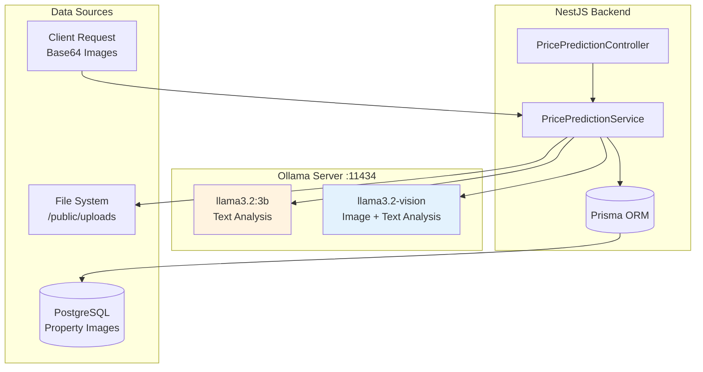
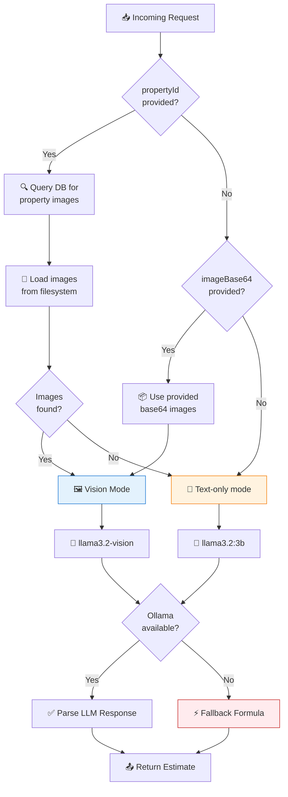
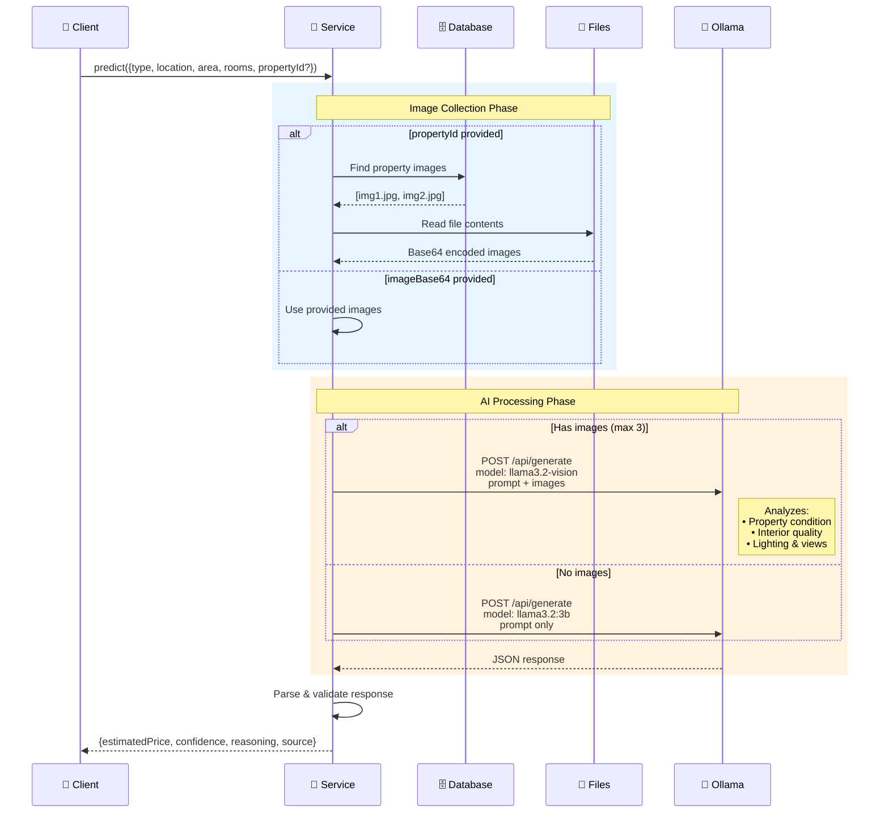
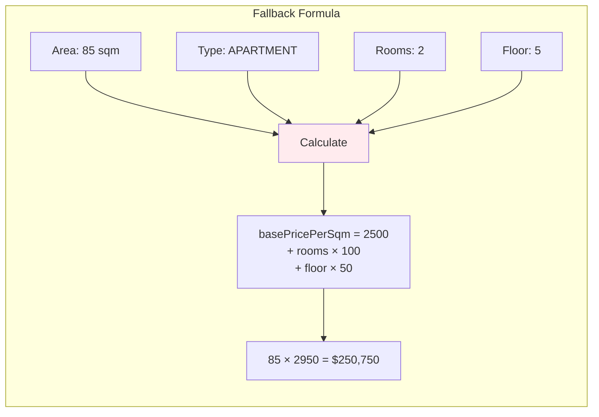

# AI Price Prediction System

## System Architecture



---

## Decision Flow



---

## Processing Pipeline



---

## Model Comparison

```mermaid
graph LR
    subgraph "Text Model: llama3.2:3b"
        T1[Type: APARTMENT]
        T2[Location: NYC]
        T3[Area: 85 sqm]
        T4[Rooms: 2]
        T1 & T2 & T3 & T4 --> TP[📝 Text Prompt]
        TP --> TM[🤖 LLM]
        TM --> TO[💰 $250,000<br/>confidence: medium]
    end

    subgraph "Vision Model: llama3.2-vision"
        V1[📝 Property Details]
        V2[🖼️ Kitchen Photo]
        V3[🖼️ Living Room]
        V4[🖼️ Exterior]
        V1 & V2 & V3 & V4 --> VP[🔮 Vision Prompt]
        VP --> VM[🤖 Vision LLM]
        VM --> VO[💰 $285,000<br/>confidence: high<br/>+"Modern renovated kitchen,<br/>good natural light"]
    end

    style TM fill:#fff3e0
    style VM fill:#e3f2fd
```

---

## Fallback System



---

## Environment Configuration

| Variable | Default | Description |
|----------|---------|-------------|
| `OLLAMA_URL` | `http://localhost:11434` | Ollama server URL |
| `OLLAMA_MODEL` | `llama3.2:3b` | Text model name |
| `OLLAMA_VISION_MODEL` | `llama3.2-vision` | Vision model name |
