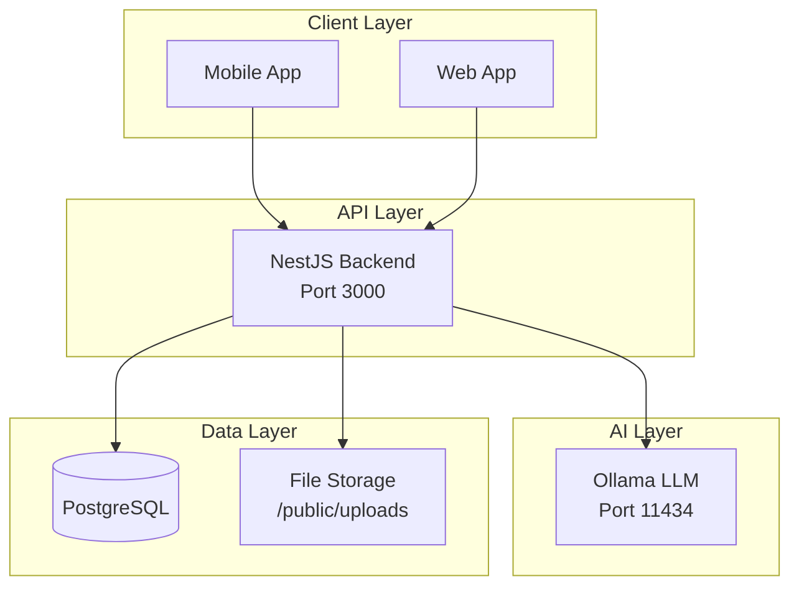
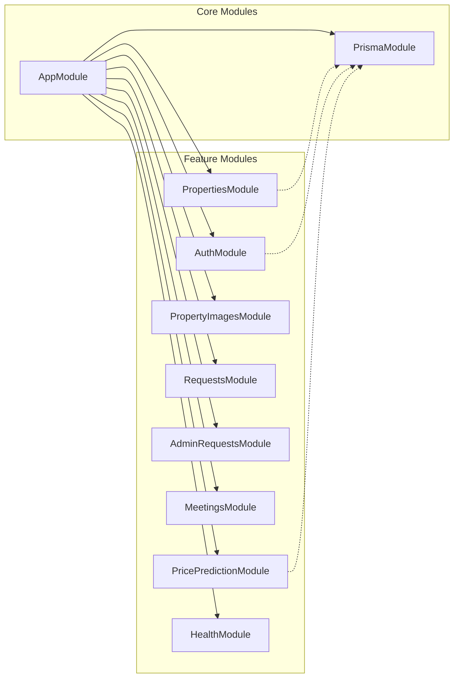
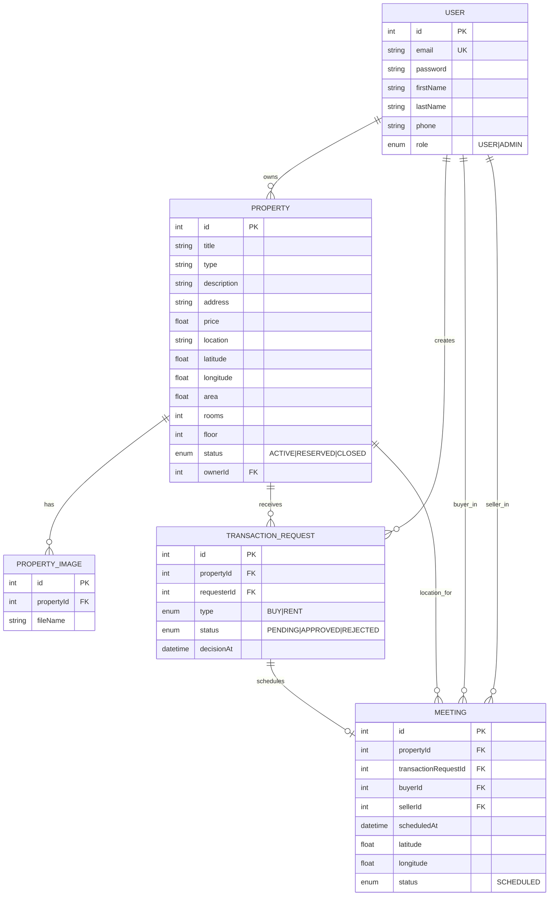
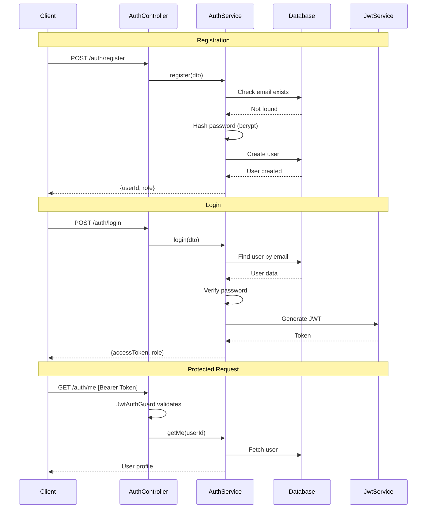
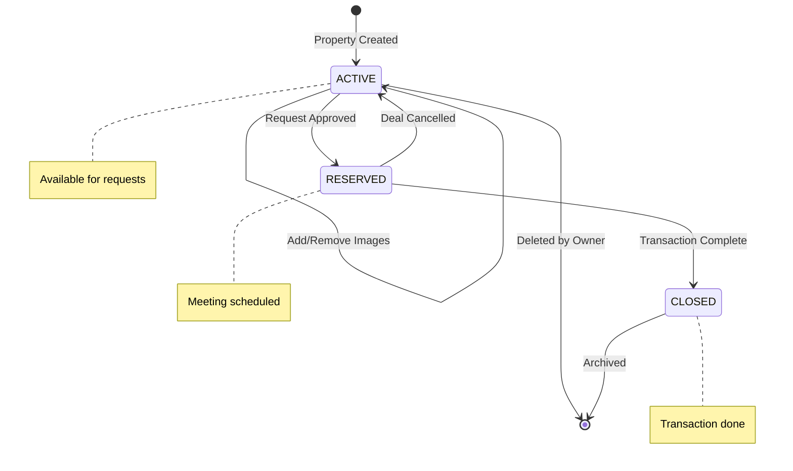
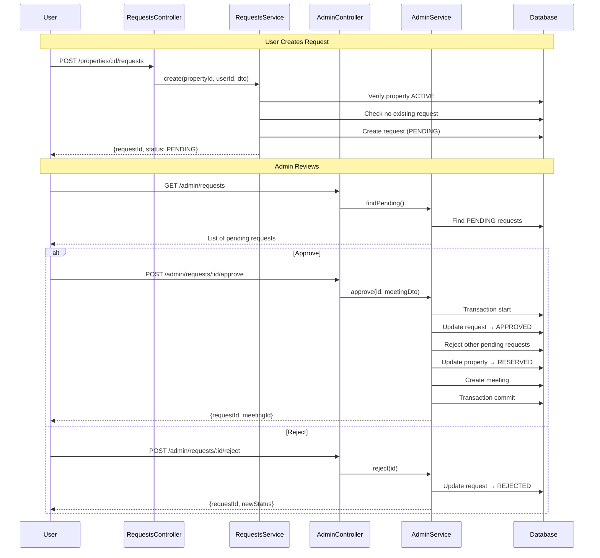
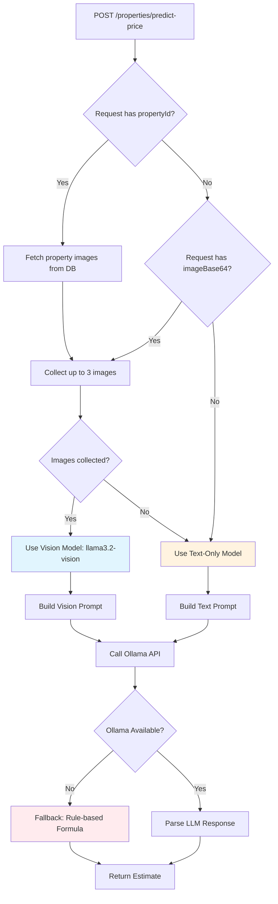
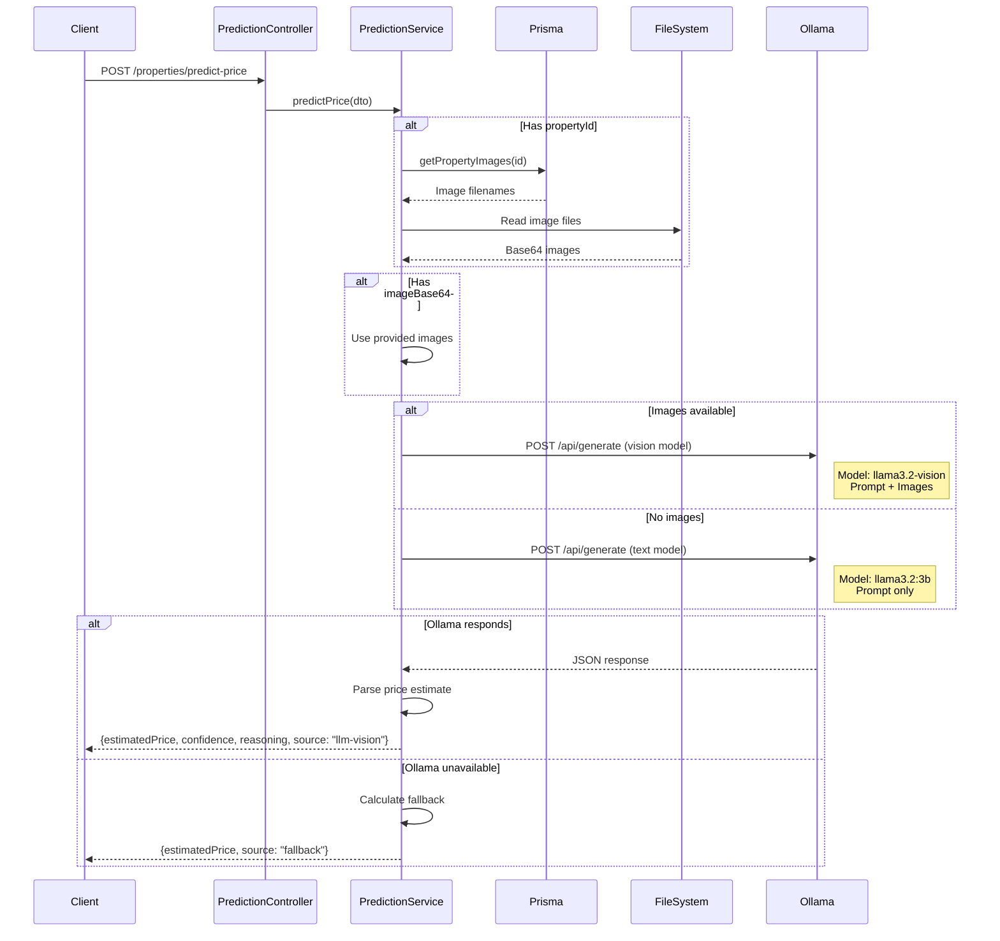
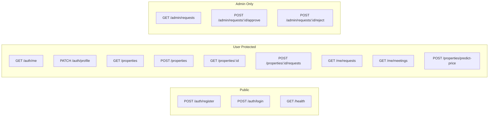
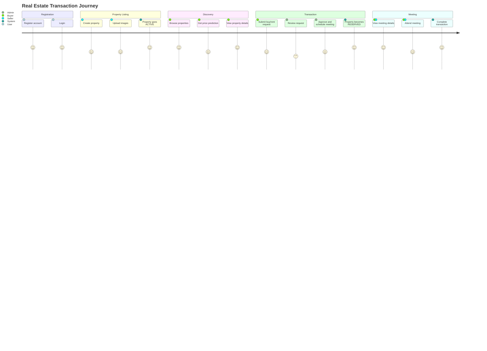

# Real Estate Backend - System Analysis

## System Overview

---

## Module Architecture

---

## Entity Relationship Diagram

---

## Authentication Flow

---

## Property Lifecycle

---

## Transaction Request Flow

---

## Price Prediction Flow

---

## Price Prediction - Detailed Sequence

---

## API Endpoints Overview

---

## Complete User Journey

---

## Technology Stack

| Layer | Technology | Purpose |
|-------|------------|---------|
| **Runtime** | Node.js | JavaScript runtime |
| **Framework** | NestJS 10.3 | Backend framework |
| **ORM** | Prisma 6.0 | Database access |
| **Database** | PostgreSQL | Data persistence |
| **Auth** | JWT + Passport | Authentication |
| **Validation** | class-validator | DTO validation |
| **File Upload** | Multer | Image handling |
| **AI/LLM** | Ollama | Price prediction |
| **Container** | Docker | Deployment |
